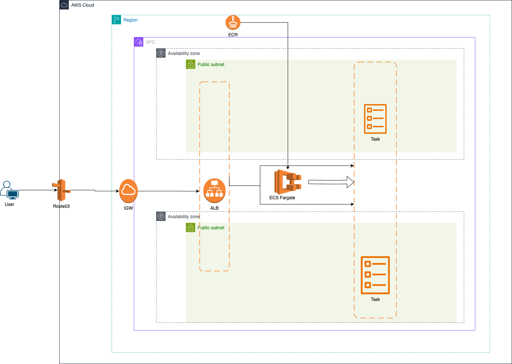

# ECS Fargate Web Application

## About Application
A simple dockerised web app application deployed on ECS Fargate with the following features.

1. The infrastructure was deployed using Terraform as IAC
2. The application runs in private customer VPC
3. A custom sub-domain [https://makers.adeleke.org](https://makers.adeleke.org) with SSL certificate enabled 
4. The Cluster service was deployed to 2 availability zones for high-availability
5. The ECS service ensures there are always two services running
6. ECR is used to host Docker images and pull to ECS
7. Access to the Cluster is only from the attached Application Load Balancer

## Application url
[https://makers.adeleke.org](https://makers.adeleke.org)

## Issues and Solutions
Below are the problems found
1. The render_template('index.htm') was changed to render_template('index.html') to make the template render works
2. The default port was updated to 5000 which is the default port of the flask
3. The Docker file was updated as appropriate to deploy Flask application

## Changes for production deployment
1. Deploy tasks to the Private subnet instead of the public subnet for more security
2. Deploy WAF in front of the application to protect against DDoS and other web server attacks
3. Enable Route53 failover
